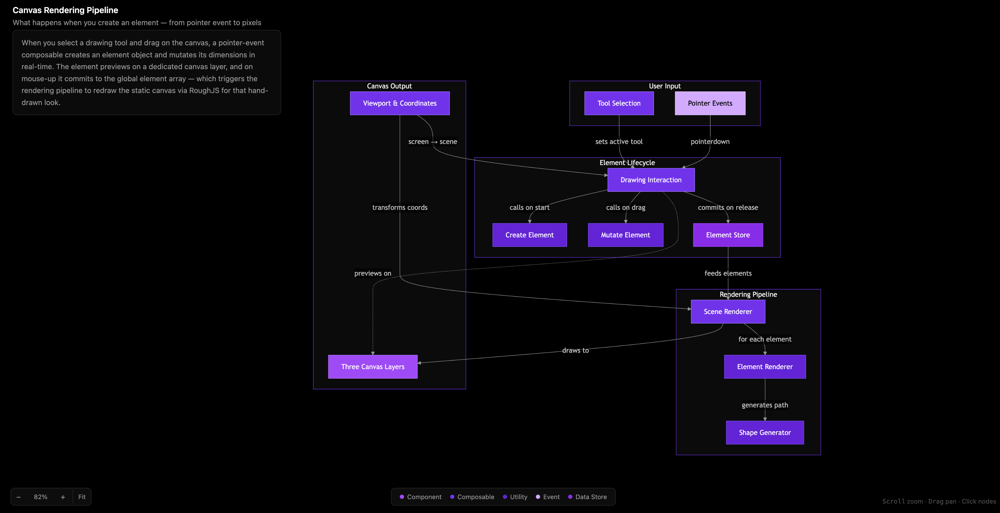

# Walkthrough Skill

A Claude Code skill that generates interactive HTML walkthroughs with clickable Mermaid diagrams — flowcharts and ER diagrams — to explain codebase features, flows, architecture, and database schemas.

Inspired by [Amp's Shareable Walkthroughs](https://ampcode.com/news/walkthrough).

## What it does

Ask Claude to walk you through any part of your codebase and it produces a self-contained HTML file with:

- A **clickable Mermaid diagram** (flowchart or ER diagram) showing the key concepts and their connections
- A **detail panel** for each node with a plain-English description, file paths, and optional code snippets
- **Pan and zoom** — scroll to zoom, drag to pan, auto-fit on load
- **Syntax highlighting** via Shiki for the rare nodes that include code
- **Dark mode** — pure black background, white text, purple accents

The goal is fast onboarding: give a new developer a mental model of how something works in under 2 minutes. Not a code reference — a map.

**[Live demo — walkthrough of the walkthrough skill itself](https://alexanderop.github.io/walkthrough/examples/walkthrough-how-it-works.html)**



## Usage

Trigger the skill with prompts like:

```
walkthrough how does authentication work
explain this flow
walk me through the checkout process
how does X work
database schema
explain the tables
```

Claude will:
1. Explore the relevant parts of your codebase using parallel subagents
2. Synthesize findings into 5-12 key concepts and their connections
3. Generate a single `walkthrough-{topic}.html` file in the project root
4. Open it in your browser

## Examples

**Feature flow:**
> Use the walkthrough skill and explain the process of what happens when a user submits a form.

**Architecture overview:**
> Walk me through how the plugin system is organized.

**Database schema (ER diagram):**
> Use the walkthrough skill and explain how the invites entity is stored in the database. Use an ER diagram.

**Data flow:**
> How does state flow from the composable to the component?

## Installation

### Quick install

```bash
npx skills add https://github.com/alexanderop/walkthrough --skill walkthrough
```

### Manual install

Copy the `skills/walkthrough/` directory into your project's `.claude/skills/` folder:

```
your-project/
  .claude/
    skills/
      walkthrough/
        skill.md
        references/
          html-patterns.md
```

## Structure

```
skills/walkthrough/
  skill.md                      # Main skill definition
  references/
    html-patterns.md            # HTML template, CSS, and JS patterns reference
```

- **skill.md** — The skill prompt that Claude follows. Defines the workflow: scope understanding, parallel codebase exploration, diagram type selection, and HTML generation.
- **references/html-patterns.md** — Complete reference for the generated HTML files: React component architecture, Mermaid config, Shiki setup, color palette, pan/zoom implementation, and all the patterns needed to produce a working walkthrough.

## Tech stack (generated files)

The output HTML files are fully self-contained with CDN dependencies:

- **React 18** (UMD) — component rendering via `React.createElement()`
- **Tailwind CSS** (CDN) — utility-first styling
- **Mermaid 11** — diagram rendering (flowcharts and ER diagrams)
- **Shiki** (ESM) — syntax highlighting with `vitesse-dark` theme

No build step. Just open the HTML file in a browser.
